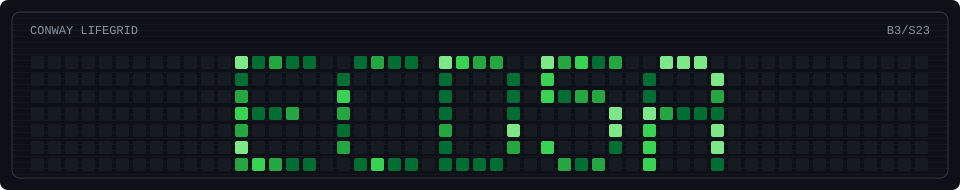

  

  

  
  
  
  
  
  

  
  
  
  
  

## /public-workbench

<table>
  <tr>
    <td width="50%" valign="top">
      <h3><a href="https://github.com/ECD5A/EllipticZero">EllipticZero</a> current lab</h3>
      
Local-first ECC and smart-contract audit workbench. Built for reproducible checks, agent-assisted review, and evidence that can be replayed.

      

        
        
        
      

      <code>ECC / audit automation / local agents / reproducible reports</code>
    </td>
    <td width="50%" valign="top">
      <h3><a href="https://github.com/ECD5A/ProofStampBot-OSS">ProofStampBot-OSS</a> released tool</h3>
      
Telegram proof bot for SHA-256 document notarization on TON. Generates receipts, payment flow, and PDF certificates for verifiable timestamps.

      

        
        
        
      

      <code>TON / Telegram / SHA-256 / receipts / timestamp proofs</code>
    </td>
  </tr>
</table>
