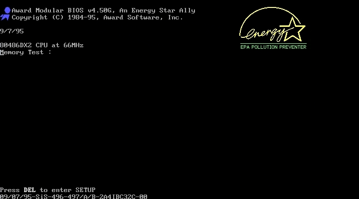
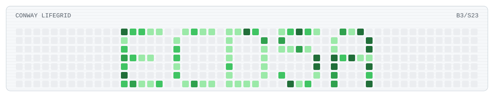

  

  <picture>
    <source media="(prefers-color-scheme: dark)" srcset="./dist/conway-contribution-grid-dark.svg">
    <source media="(prefers-color-scheme: light)" srcset="./dist/conway-contribution-grid.svg">
    
  </picture>

  
  
  
  
  
  

  
  
  
  
  

