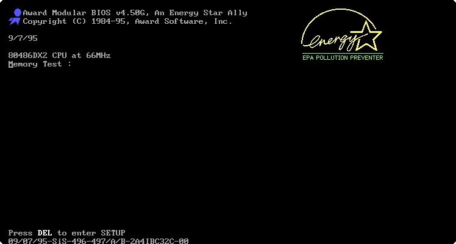
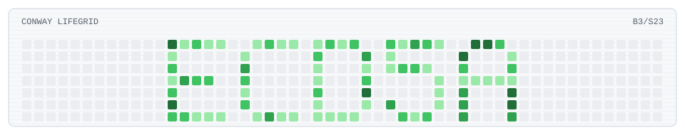

  <picture>
    <source media="(prefers-color-scheme: dark)" srcset="./assets/boot.gif">
    <source media="(prefers-color-scheme: light)" srcset="./assets/boot-light.gif">
    
  </picture> 
  <picture>
    <source media="(prefers-color-scheme: dark)" srcset="./dist/conway-contribution-grid-dark.svg">
    <source media="(prefers-color-scheme: light)" srcset="./dist/conway-contribution-grid.svg">
    
  </picture>

